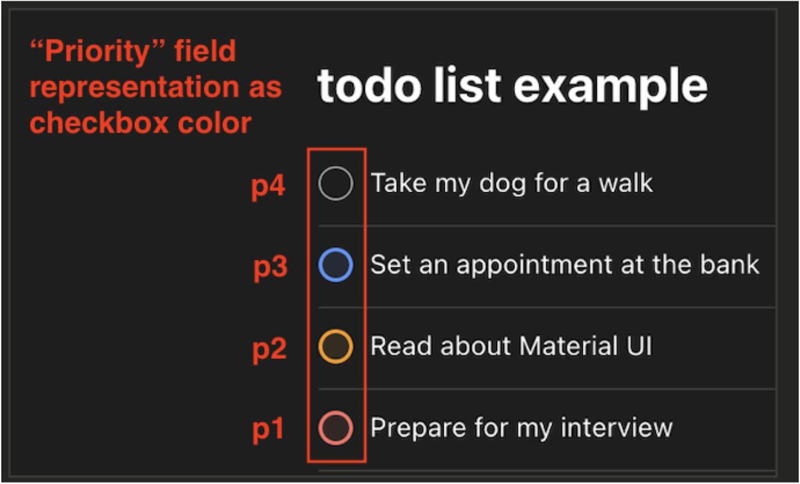

# **Home Coding Challenge \- To-do list**

**Application:** A simple to-do list web application that runs locally on your machine.

## **Technological Stack**

* **Core**: React, TypeScript  
* **Bundling Tool:** [Vitejs.dev](https://vitejs.dev/) (see “Application Bundler Tool” section)  
* **Testing:** Jest, or Vitest.  
* **Styling:** TailwindCSS  
* **State Management**: Choose one that works for you \- React context, redux, etc.  
* **UI Library**: Material UI (known as “mui”)  
* **Storybook:** Utilized for “shared” components  
* **Package manager:** use your favorite package manager  
* **3rd party packages:** Besides the specific packages required, you can use any 3rd party package, as long as you follow the “Engineering Sections”.  
* **Npm-scripts \-** please review what commands you should have and ensure working in your package.json (See “commands” section).

## **General Notes**

* If any requirement is unclear to you or you find it not reasonable, you can skip it, but you should explain that it is missing and explain your reasons. List the requirements you did NOT implement in your repository README.md.   
  For example: skipping accessibility requirements, skipping Storybook setup, etc.  
* No backend is needed.  
* Review all “Engineering Sections” for guidance and clarifications.  
* Project Structure**:** Use a clean and organized project structure, following best practices.  
* Publish the task to a public repository in GitHub and share it with us by the agreed deadline, to enable us to review and run your code before the interview.  
* Ensure everything in the project works (tools, commands, UI, etc.) on your local machine before the interview starts.  
* You can use any tools you like, including LLMs, but ensure to be highly familiar with the code you submit, at Snappy we use LLMs during our work, but everything must stand by our standards before we submit/ask someone else to review.

# **Product Requirements**

Note: see the “Design” section below to have an idea of what it should approximately look like.

**Entity Requirements**

**A “todo” should have the following properties**

| Field name | Description | type |
| :---- | :---- | :---- |
| name | a short text describing what should be done in the “todo” | string |
| priority | indicates the urgency of the “todo” | number (between 1-4) |
| completed | Indicates if the “todo” has been completed | boolean |

**Feature Scope**

| Requirement | Description |
| :---- | :---- |
| Create a new “todo” | A short form, or equivalent UI to set the name and priority. Default values: “completed: false” |
| Edit a “todo” name property | The “todo” name should be editable |
| Delete a “todo” | A “trash” icon to delete the “todo” from the “todo list”  |
| “todo” should be mark-able | Checking a “todo” should set the “completed” field to “true”, and unchecking it back to “false”. |

**UI Elements Requirements**

The following components should be created as part of the development.

“shared” components **(See “Shared UI Elements” section below)**

* Checkbox  
* TextInput  
* Dropdown  
* IconButton

Logical non-shared components

* A todo item  
* A todo list

**Data Requirements (See “Analytics Infrastructure” section below)**

* Capture an analytics event every time a to-do is created  
* Capture an analytics event every time a to-do is marked

```javascript

// todo created event
eventName: "todo_created"
payload: { todo_name: string }
// todo marked event
eventName: "todo_marked"
payload: { todo_name: string, priority: number }
```

**Responsiveness Requirements (See “Responsive UI” section below)**

The to-do list should support a single breakpoint, in a way the entire “todo” list and its items will be useable for the screens that are below the breakpoint and above it.

**Accessibility Requirements (See “Accessibility” section below)**

* Support tabs from top-left to bottom-right  
* Support the “Enter” and “ESC” key press according to the intuitiveness of the action the user tries to perform.

**Persistence Requirements (See “Stateful vs. Stateless” section below)**

* The “todo” items and the list should persist on tab refresh.

## **Quality Requirements**

**Testing:** 

1. Write a simple test for a to-do, that will prevent future regressions.  
2. Write a test that the analytics’ “capture” function is called once when a to-do item is marked as “completed” once, as expected.

**Component APIs**

Ensure that your Components API, both “shared” and “logical non-shared” components expose a clean, business-logic-free API.

# 

# **Design**

The design provides an approximate expected result, you do not have to fully use it but the baseline is more important for setting expectations for the interview.

## Product Behavior

### **The todo-list**


### **Todo item**


#### **Todo item Priority**



#### **Completed Items**


## Responsive UI Design

### **Large Screen View (Desktop/Large Tablet, above 768px)**


## **Small Screen (Mobile/Small Tablet, below 768px)**

  


## Storybook Example

Took from Snappy’s storybook, Storybook comes out of the box with a slightly different design, do not spend time on Storybook design.

The example provides an idea of what is expected to be seen during the interview.

## 

# **Engineering Sections**

The sections below describe what is expected from your application to have from an engineering perspective.

## **Commands**

**Tooling Setup**: Ensure the following setups work in your project as an npm-scripts

* “start” \- bundler tool “dev server”  
* “build” \- bundler tool production build  
* “storybook” \- Storybook “dev server” 
* “test” \- running tests, and all tests pass successfully

## **Application Bundler Tool**

Modern tools are in charge of both development environments (local env) and production build.

**Note:** Ensure your production build minifies your production bundle.

See Vitejs.dev getting started [here](https://vitejs.dev/guide/).

## **Analytics Infrastructure**

Create a “dummy” analytics module that exposes a client with a method “capture”

Implement a React hook that will return a client instance that will be used by relevant components.

The capture function should expose

```javascript
// analytics-modules.ts
// capture function signature
// should print to console the event details
capture(eventName: string, payload: any): void;

// analytics.hook.ts
import { AnalyticsModule } from '<some-path>/analytics-modules';
// ...
export { useAnalytics };
// The hook consumer component
const { client } = useAnalytics();
```

The capture should console.log both eventName and payload

## **Shared UI Elements**

Shared UI elements should be developed first on “Storybook” to ensure their component API is clean and to enable stakeholders, like designers and developers, to review the shared components' controls without running or opening the application.

**Note:** When using a UI Library component for your shared component, ensure you expose through your shared component wrapper only the fields your application requires at the moment.

See Storybook “Getting Started” [here](https://storybook.js.org/docs).

## **Responsive UI**

The development should always keep responsiveness in mind, state-of-the-art UI libraries usually provide utilities and hooks to integrate screen breakpoints into your UI.

See Material UI’s Responsive UI [here](https://mui.com/material-ui/guides/responsive-ui/).

**The breakpoint should be set to 768px.**

## **Accessibility**

**Tabs**

Jump between elements using tabs should be from top-left to bottom-right, in a way a user who can’t use a mouse can move logically between elements in your application.

See [tab indexes](https://developer.mozilla.org/en-US/docs/Web/HTML/Global\_attributes/tabindex)

**Key Presses**

Using the “Enter” and “Esc” keys to enable a user who can’t use the mouse to be able to “submit” user inputs and close UI elements or cancel actions.

## **Stateful vs. Stateless Components**

**Stateful components**   
are components that use state management or depend on data fetching from an external resource to be able to render properly, 

**Note**: You should minimize the number of stateful components in your application, even if it means creating more components to decouple between a stateful action and a component.  
**Note \#2:** Stateful components are harder to test due to the need to mock the state part, but you can see how to do so for Redux [here](https://redux.js.org/usage/writing-tests\#setting-up-a-test-environment).

**Stateless components**  
Components that need only properties drilling/component API to render properly.  
“shared” and “logical non-shared” components should be stateless.

## **Testing**

Use one of

* [Jest getting started for Vite](https://jestjs.io/docs/getting-started\#using-vite)  
* [Vitest getting started](https://vitest.dev/guide/)

More info:

* How to test stateful components using redux \- [set an environment](https://redux.js.org/usage/writing-tests\#setting-up-a-test-environment)

## **Styling Methodology**

* Use the BEM methodology, see the introduction [here](https://getbem.com/introduction/).  
* Material UI \- [working with TailwindCSS](https://mui.com/base-ui/guides/working-with-tailwind-css/)  
* Please ensure padding and margins are always a multiple of 4px (4, 8, 12, 16, etc.)

# **Bonus Requirements**

**IMPORTANT:** Bonus requirements are nice to have, but please ensure everything else is completed well before starting any bonus requirement, the “core” requirements are more important.

## 1\. Connecting an API

Present the US flag on your application's top header using [this open-source countries API](https://restcountries.com/\#endpoints-all). 

## 2\. Creativity

Develop a new enhancement, according to your choice, and apply it to your to-do list, your north-star metric for the enhancement can be: “cool”, “useful”, “silliness”, or “boredom”.  
This is an opportunity to show your creativity skills 😎